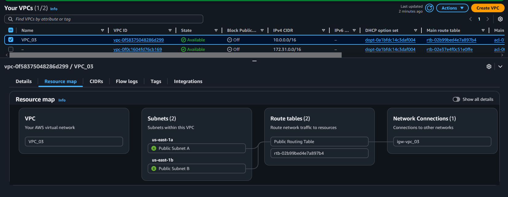
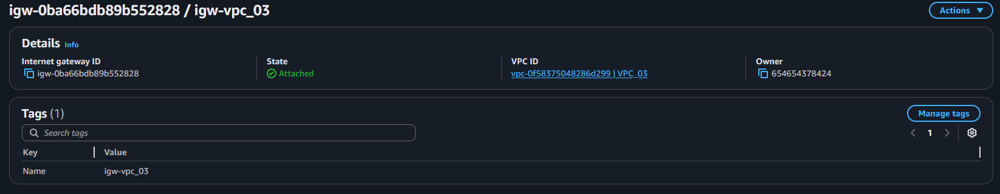
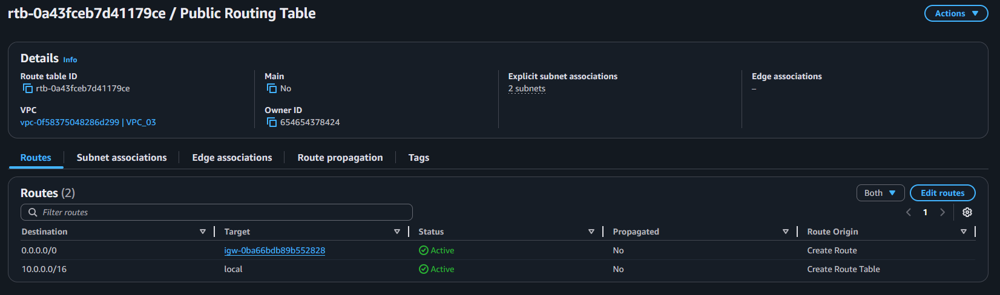
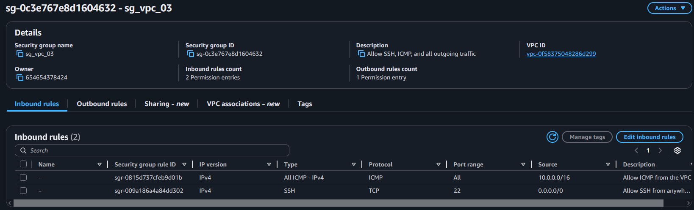
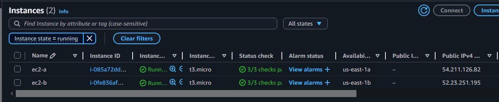
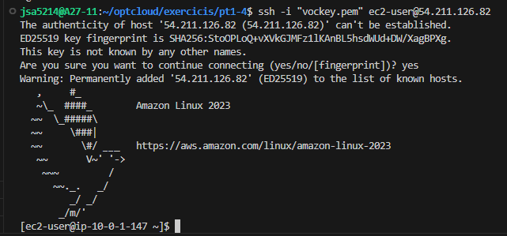
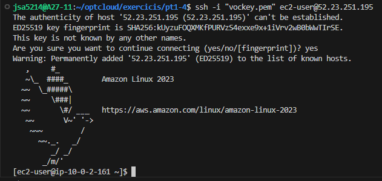
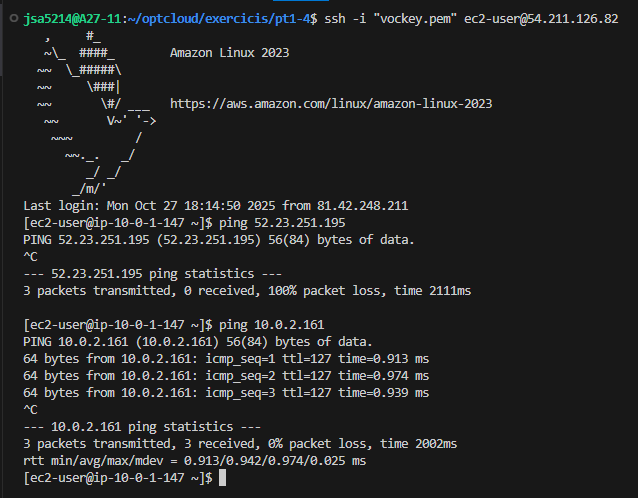

<h1>VPC&Subnets</h1>

<h1>Internet Gateway</h1>

<h1>Routing Tables</h1>

<h1>Security Groups</h1>

<h1>Instances</h1>

# Checks
## SSH Login ec2-a

## SSH Login ec2-b

## Ping
### It works when pinging one instance to another using private IP's. But it fails when pinging using the public IP's

