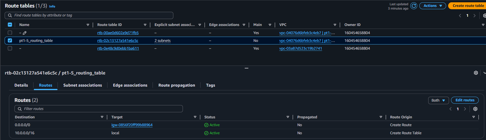
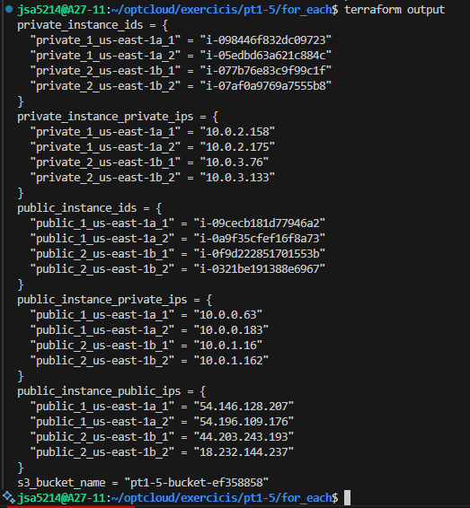

# AWS Infrastructure
## VPC&Subnets

## Internet Gateway

## Routing Tables

## Security Groups

## Instances

# Output

# Checks
## SSH Login
### Los designios de AWS hace que no funcione pese a que tiene puesto 0.0.0.0/0 como IP permitida.

## Ping
### It works within the VPC (private IP's) but it does't using the public IP's.
