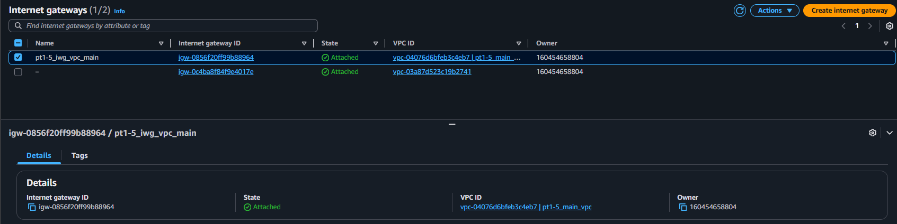
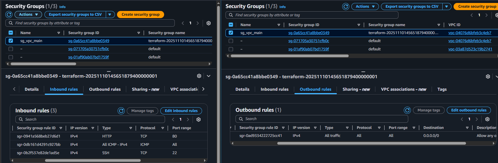
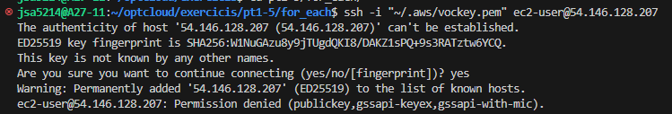

# AWS Infrastructure
## VPC&Subnets

## Internet Gateway

## Routing Tables

## Security Groups

## Instances

# Checks
## SSH Login ec2-a

## Ping
### It works withing the VPC (private IP's) but it does't using public

